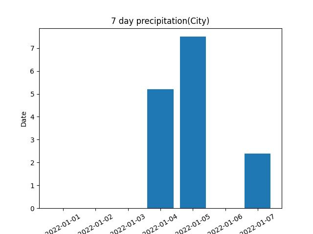
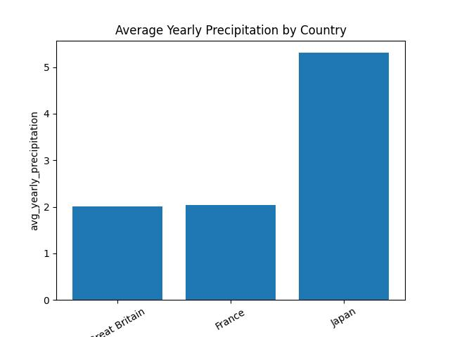
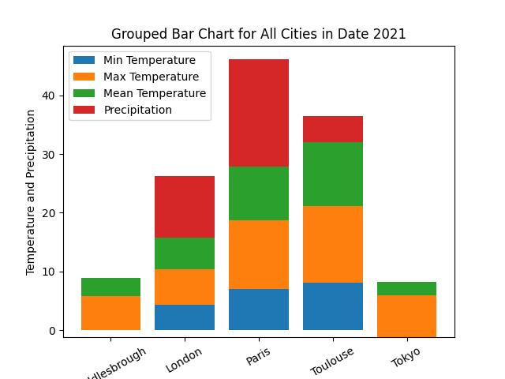
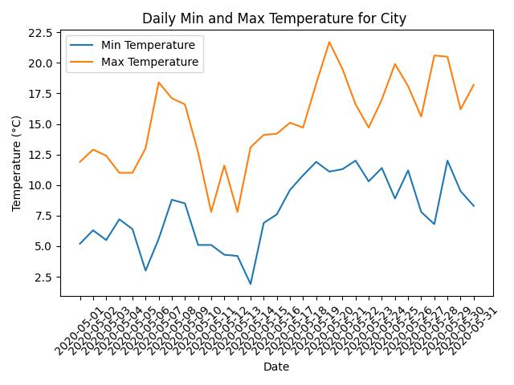

# READ ME FILE FOR CHARTS IN PHASE 2
In order to complete this project, temperature data must be retrieved from a SQL database and visualized.

## Author
- Name: Rebecca Agbolade
- Student ID: D3077427

### Plot 1: 7 Day Precipitation
The precipitation totals over a seven-day period are displayed visually in the seven-day precipitation plot. Finding trends and patterns in the precipitation that may be important for weather study or planning can be done with the help of this plot. Time is shown by the x-axis, and the total amount of precipitation is represented by the y-axis.

### Plot 2:Average Yearly Precipitation by country
The average annual precipitation by country for the year 2020 is displayed in this plot. Every bar depicts a country and shows the average amount of precipitation seen in its cities. The names of the countries are shown on the x-axis, and the average annual precipitation  is shown on the y-axis. The chart offers a comparison of the amount of precipitation in different countries.

### Plot 3:Grouped bar chart
This grouped bar chart shows meteorological data for several cities on a given day (in this case, '2020-03-05'). A series of bars, one for each city, display the mean, maximum, and lowest temperatures as well as the amount of precipitation. City names are displayed on the x-axis, while temperature and precipitation values are displayed on the y-axis. The graphic offers a thorough comparison of the weather in different locations.

### Plot 4:Scatter plot
This chart shows the average yearly precipitation by country for the year 2020. Each bar represents a nation and displays the typical level of precipitation experienced  The y-axis displays the average yearly precipitation, while the x-axis displays the names of the country. A comparison of the amount of precipitation in different countries is provided by the chart.

### Plot 5:Average yearly precipitation by country
This scatter plot displays, for a certain time (in this case, '2020-01-01' to '2020-01-31'), the average annual temperature and precipitation for several nations. The average temperature (shown by circles) and amount of precipitation (represented by asterisks) at each point correspond to a particular date. Dates are displayed on the x-axis, and precipitation amounts and temperature in degrees Celsius are displayed on the y-axis. A visual association between temperature and precipitation trends throughout time is shown in the graphic.

### Plot 6:Multi Line Chart
The daily minimum and maximum temperatures for a particular city in May 2020 are shown in this multi-line chart. The temperature trend throughout time is shown by each line. Dates are shown on the x-axis, and temperature in degrees Celsius is represented on the y-axis. The temperature fluctuations over the course of the month are represented visually in the chart.

# Prerequisites
To run this program, the following were done:
**Libraries:** Matplotlib, SQLite 3 libraries were downloaded.
**Visual Studio Code:** Visual Studio Code was also used to run this program
